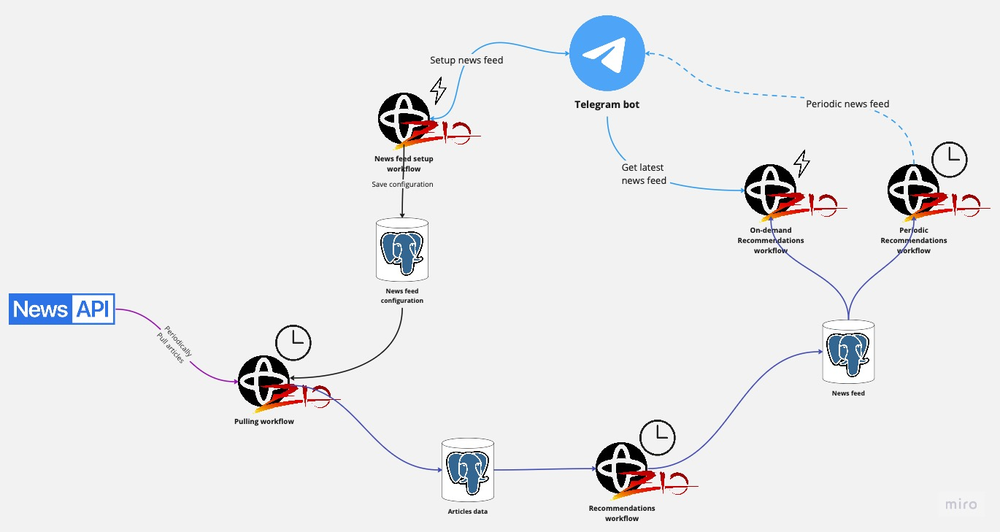

# Content sync
Fetch various content (such as news, videos) and periodically get them through Telegram Bot.  

## TODOs
- [ ] Generalize pullers 
- [ ] Move youtube/newsapi into specific packages

## Supported integrations
- [News API](https://newsapi.org/docs/get-started)
- [Youtube Data API V3](https://developers.google.com/youtube/v3/docs)

## Architecture diagram

## Run examples
**(1)** Create a `secret.env` file in the project root. It must contain the following secrets:
- Telegram (taken from BotFather):
  - **TELEGRAM_BOT_TOKEN**
  - **TELEGRAM_BOT_USERNAME** 
- Youtube (taken from google console):
  - **OAUTH2_CLIENT_CLIENT_ID**
  - **OAUTH2_CLIENT_CLIENT_SECRET**

**(2)**
TBD