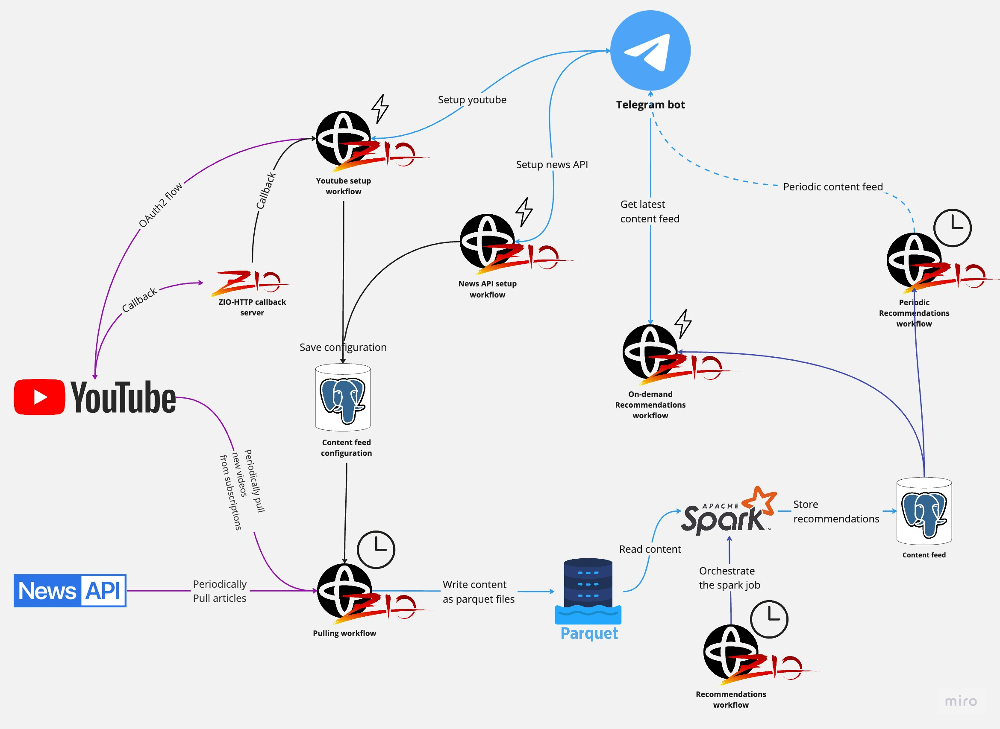

# Content sync
Fetch various content (such as news, videos) and periodically get them through Telegram Bot.

## Supported integrations
- [News API](https://newsapi.org/docs/get-started)
- [Youtube Data API V3](https://developers.google.com/youtube/v3/docs)

## Architecture diagram


## Stack
- **ZIO**
  - ZIO Temporal (Protobuf transport)
  - ZIO Streams,
  - ZIO Logging
  - ZIO Config
  - ZIO JSON
  - ZIO HTTP
- **Data processing**
  - Apache Spark
- **Database layer**
  - ZIO Quill
  - Flyway
- **Integrations**
  - STTP
  - Official Google API Client
  - Telegramium
- **Testing**
  - ZIO Temporal Testkit 
  - ZIO Test
  - Mockito

## How to read the code
- [Model](./model) contains definitions for domain entities
- [Service commons](./service-commons) contains code shared among backend components
  - [Shared protobuf](./service-commons/src/main/protobuf)
  - [Flyway migrations](./service-commons/src/main/resources/db/migration)
- [Content puller](./content-puller) pulls data from integrations
  - [Protobuf](./content-puller/src/main/protobuf)
  - [Tests](./content-puller/src/test)
- [Content processor job](./content-processor-job) processes pulled data & creates recommendation feed using Apache Spark
- [Content processor launcher](./content-processor-launcher) orchestrates the Spark job using Temporal
  - [Protobuf](./content-processor-launcher/src/main/protobuf)
- [Content processor shared](./content-processor-shared) code shared between the job and the launcher
- [Telegram bot](./telegram-bot) - the bot implementation
  - [Protobuf](./telegram-bot/src/main/protobuf)

## Run examples
**(1)** Create a `secret.env` file in the project root. It must contain the following secrets:
- Telegram (taken from BotFather):
  - **TELEGRAM_BOT_TOKEN**
  - **TELEGRAM_BOT_USERNAME**
- Youtube (taken from google console):
  - **OAUTH2_CLIENT_CLIENT_ID**
  - **OAUTH2_CLIENT_CLIENT_SECRET**

**Integration Notes:**
- Telegram Bot [FAQ](https://core.telegram.org/bots/faq)
- Youtube API [Getting started guide](https://developers.google.com/youtube/v3/getting-started)

**(2)** Start temporal cluster  
(either on your own or in Docker from the [parent directory](../docker-compose.yaml))

**(3)** Download the corresponding [Apache Spark](https://spark.apache.org/downloads.html) artifact to the `./spark_home` directory.  

**(4a)** Run each component locally:
```shell
# Initialize database
make start-local-env
# content sync components
make start-puller-local
make start-processor-launcher-local
make start-telegram-bot-local
```

**(4b)** Or assemble docker images & run them:
```shell
# build docker images
sbt docker:publishLocal

# start dockerized env
make start-dockerized-env
```

**(5)** Interact with the Telegram bot!  
