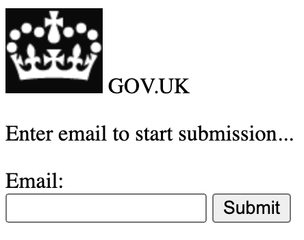
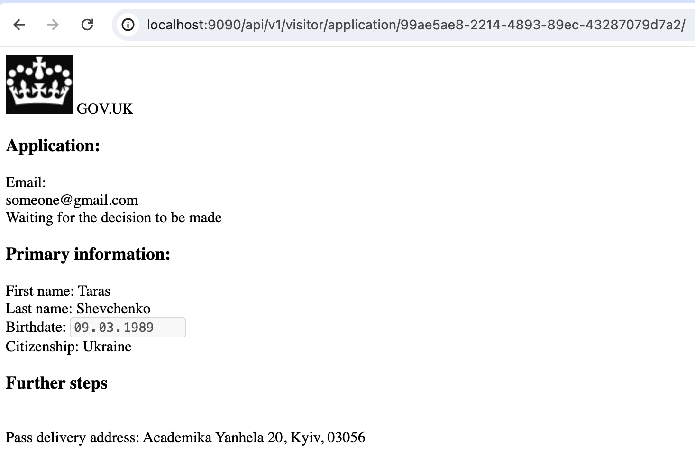
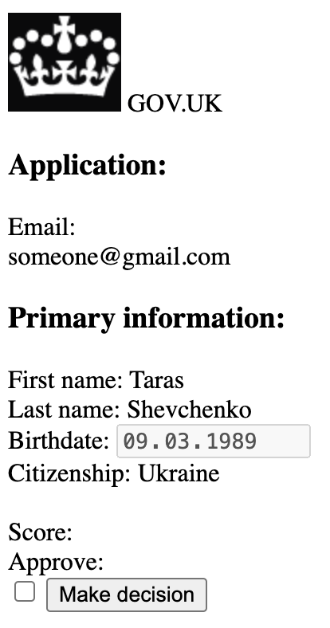
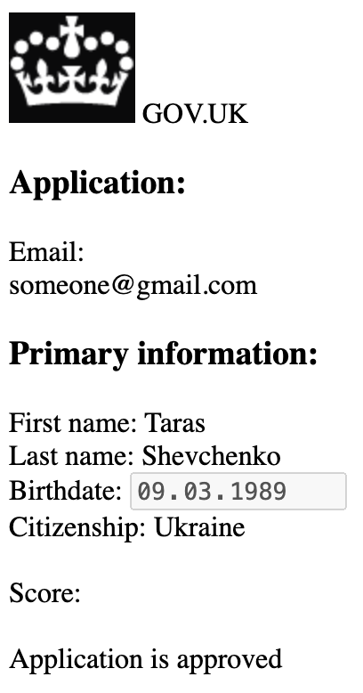
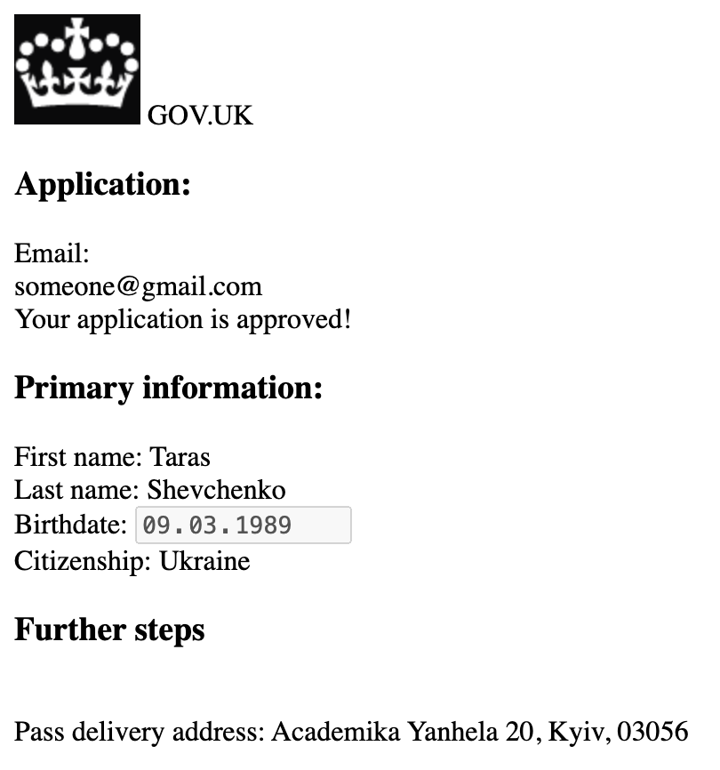

# UKVI Visa application app

How to run the example:

1. Run the [Main object](src/main/scala/dev/vhonta/ukvi/visa/Main.scala)
2. Open http://localhost:9090/ in your browser. You should see the following page:
   
3. Enter anything in the email box and proceed with the application!
4. At the end, you're form should look like this
   
5. Update the URL in your browser to access admin UI. For instance, if the application has url
   like `http://localhost:9090/api/v1/visitor/application/:uuid:/`, make
   it `http://localhost:9090/api/v1/admin/visitor/application/:uuid:/`
6. The admin UI looks like follows:
   
7. Click on the "approve" checkbox and "make decision" button. The application is now approved
   
8. Go back to the regular UI `http://localhost:9090/api/v1/visitor/application/:uuid:/`. Your application should like
   the following:
   